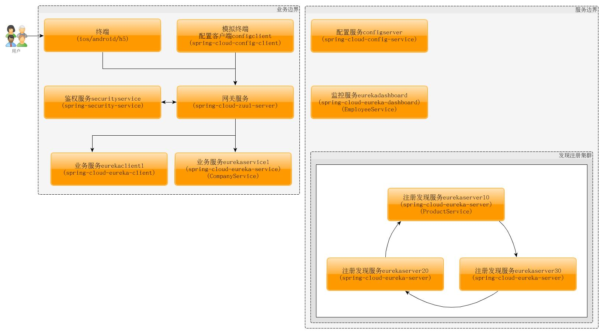

# spring-cloud-demo
项目demo包含分布式配置[Config](https://github.com/spring-cloud-samples/configserver)、服务发现[Eureka](https://github.com/spring-cloud-samples/eureka)、REST声明式客户端[Feign](https://github.com/spring-cloud-samples/feign-eureka)、断路器[Hystrix](http://cloud.spring.io/spring-cloud-netflix/spring-cloud-netflix.html)、客户端负载均衡[Ribbon](http://cloud.spring.io/spring-cloud-netflix/spring-cloud-netflix.html)、服务网关[Zuul](https://github.com/spring-cloud-samples/zuul-server)、鉴权服务[oAuth2](https://github.com/spring-cloud-samples/authserver)。

##项目结构图:

## spirng-cloud-config-server

## spirng-cloud-config-client

## spirng-cloud-eureka-server

## spring-cloud-eureka-service

## spring-cloud-eureka-client

## spring-cloud-eureka-dashboard

## spring-cloud-eureka-dashboard

## spring-cloud-zuul-server

## spring-cloud-security-service
